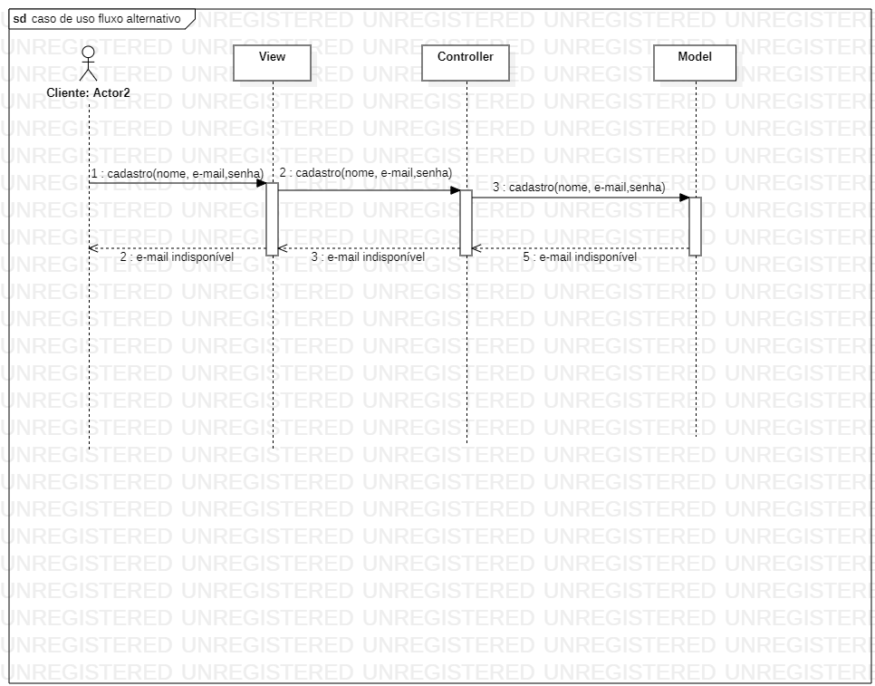

# Projeto Nova studio  

Projeto Final do Curso Técnico Integrado de Desenvolvimento de Sistemas - Colégio Pedro II - Campus Duque de Caxias

**Integrantes:**
 - Débora Santos 
 - Flávia Eduarda
 - Matheus Pereira 
 - Solene Carvalho

 ## Descrição do Projeto

O **Studio Nova** é um espaço acolhedor de ambiente agradável, onde as clientes são atendidos por profissionais qualificados e preocupados em proporcionar momentos adoráveis. Com serviços de qualidade. Um local no qual os profissionais entendem que o trabalho em equipe e a capacitação profissional são necessários para a excelência no atendimento e satisfação das clientes.
Temos como objetivo oferecer as clientes opções de serviços e uma equipe multiprofissional para que tenham um atendimento estético de qualidade.
Nosso Espaço oferece as clientes serviços de  Maquiagem, extensão de cílios, design de sobrancelha, depilação facial.

**Aqui nós não fazemos nada mais do que realçar essa beleza incrível que existe dentro de ti!**

Valores-
Comprometimento, responsabilidade e honestidade.

**Sua autoestima em primeiro lugar sempre!!!**

## Documentação

- [Manual do Usuário](manual.md)
- [Requisitos](requisitos.md)
- [Casos de Uso](casos-de-uso.md)
- [Apresentação](apresentacao.pdf)

**Diagrama de Classes**

**Modelagem do Banco de Dados**

