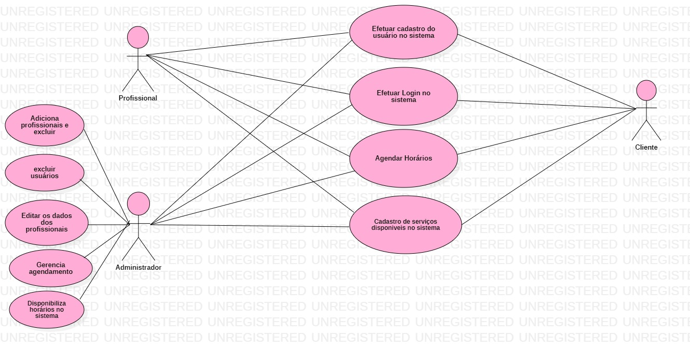

# Documento de Casos de Uso

## Lista dos Casos de Uso

 - [CDU 01](#CDU-01): Cadastro de usuário;
 - [CDU 02](#CDU-02): Efetuar login;
 - [CDU 03](#CDU-03): Controle de usuário;
 - [CDU 04](#CDU-04): Adição de profissionais;
 - [CDU 05](#CDU-05): Exclusão de usuário;
 - [CDU 06](#CDU-06): Edição de usuário;
 - [CDU 07](#CDU-07): Agendamento;   
 - [CDU 08](#CDU-08): Disponibilizar horários;
 

## Lista dos Atores

 - Clientes;
 - Funcionários; 
 - Administrador;

## Diagrama de Casos de Uso

## Descrição dos Casos de Uso

### CDU 01 Cadastro de usuário 

**Fluxo Principal**

1. O sistema apresentara um formulário com os campos do usuário a ser inserido
2. O usuário insere nome, e-mail e senha.
3. O usuário clica no botão “Enviar”.
4. O sistema armazena o usuário e informa que a "operação foi realizada com sucesso".
5. O sistema retorna ao início do caso de uso para inclusão de novo usuário. 

**Fluxo Alternativo A**
1. O sistema apresentara um formulário com os campos do usuário a ser inserido.
2. O usuário insere nome, e-mail e senha.
3. O usuário clica no botão “Enviar”.
4. O sistema informa que o endereço de e-mail está incorreto.
5. O usuário digita o e-mail corretamente e clica no botão “Enviar”.
6. O sistema armazena o usuário e informa que a "operação foi realizada".
7. O sistema retorna ao início do caso de uso para inclusão de novo usuário. 

**Fluxo alternativo B**
1. O sistema apresentara um formulário com os campos do usuário a ser inserido.
2. O usuário insere nome, e-mail e senha.
3. O usuário clica no botão “Inserir”.
4. O sistema informa que já existe um usuário com o e-mail fornecido e retorna ao Fluxo Principal.

**Fluxo alternativo C**
1. O sistema apresenta uma solicitação de criação de conta com as respectivas informações.
2. O usuário clica no botão “Criar esta conta”.
3. O sistema exibe um formulário com os campos do uruário a ser inserido com nome, e-mail e senha preenchido.
4. O usuário clica no botão “Inserir”.
5. O sistema armazena o cliente e informa ao usuário que a "operação foi realizada com sucesso". 

 ### CDU 02 Efetuar login  

 **Fluxo Principal**

1. O sistema exibirá um formulário com os campos login e senha.
2. O usuário deve inserir o login e a senha e clicar no botão de "ENTRA". 
3. O sistema valida login e senha do usuário.
4. O sistema encaminha o usuário para a página do cliente.

**Fluxo Alternativo A**

1. O sistema exibirá um formulário com os campos login e senha.
2. O usuário deve inserir o login e a senha e clicar no botão de "ENTRA".
3. O sistema informa que a senha está incorreta.
4. O usuário corrigir a senha e clica no botão "ENTRA".
5. O sistema encaminha o usuário para a página do cliente.

**Fluxo Alternativo B**

1. O sistma exibirá um formulário com os campos login e senha.
2. O usuário deve inserir o login e a senha e clicar no botão "ENTRA".
3. O sistema informa que o login está incorreto.
4. O usuário digita corretamente o login e clica no botão "ENTRA". 
5. O sistema encaminha o usuário para a página do cliente.

**Fluxo Alternativo c**
1. O sistema exibirá um formulário com os campos login e senha.
2. O usuário deve insere login e sua senha e clica no botão “ENTRA”.
3. O sistema informa que o login e a senha não coincidem.
4. O usuário digita corretamente as informações de login e senha e clica no botão “ENTRA”.
5. O sistema encaminha o usuário para sua página do cliente.

### CDU 03 Controle de usuário

**Fluxo Principal**

1. Os administradores tem uma página de controle.
2. Onde o administrador tem acesso a todos os usuários da sistema.
3. Os administadores podem excluir,editar informações do agendamento.
4. Os administadores podem cadastra serviços e disponibilizar tabela com o preço de serviço cada serviço.
5.O administador pode excluir e editar informações dos profissionais e dos clientes.

### CDU 04 Adição de profissionais 

**Fluxo Principal**

1. Os administradores tem uma página de controle.
2. Onde o administrador tem acesso a todos os usuários da rede.
3. Um profissional só pode ser cadastrado no sistema após adm fazer seu cadastro.
4. Somente administrador pode concede cadastro ao profissional.
5. Após o adm cadastra o profissional ele pode ter acesso ao sistema atraves do seu login.

### CDU 05 Exclusão de usuário

**Fluxo Principal**
1. O sistema vai apresenta um formulario com a lista de usuários.
2. O administrador escolher um perfil para exclui. 
3. O administrador clica no botão "exclui".
4. O sistema vai exibir a sequinte mensagem " tem certeza que deseja excluir o usuário"
5. O administrador clica no botão "ok".  
6. O sistema exibirá que "o usurio foi excluído com sucesso". 

**Fluxo Alternativo A**
1. O sistema vai apresenta um formulario com a lista de usuários.
2. O administrador escolher um perfil para exclui. 
3. O administrador clica no botão "exclui".
4. O sistema vai exibir a sequinte mensagem " Não foi possível excluir o usuário".
5. O sistema encaminhara o administrador para a pagina inicial.

### CDU 06 Edição de usuário

**Fluxo Principal**
1. O sistema vai apresenta um formulario com a lista de usuários.
2. O administrador escolher um perfil para editar. 
3. O administrador clica no botão "editar".
4. O sistema vai exibir a sequinte mensagem " tem certeza que deseja editar o usuário"
5. O administrador clica no botão "ok".  
6. O sistema exibirá que "o usuário foi editado com sucesso". 

**Fluxo Alternativo A**
1. O sistema vai apresenta um formulario com a lista de usuários.
2. O administrador escolher um perfil para editar. 
3. O administrador clica no botão "edição".
4. O sistema vai exibir a sequinte mensagem " Não foi possível editar o usuário".
5. O sistema encaminhara o administrador para a pagina inicial.

### CDU 07 Agendamento

**Fluxo Principal**
1. O sistema vai apresenta ao cliente uma página com os serviços, horários disponiveis e tabela com preço de cada serviço.
2. O cliente vai até a página com os horários disponiveis.
3. Escolhe o serviço e agenda para o dia e a hora de sua preferência.
4. O sistema vai marca o serviço com os profissional disponivel.
 

### CDU 08 Disponibilizar horários

**Fluxo Principal**
1. O sistema vai apresenta ao cliente uma página com os serviços, horários disponiveis de cada serviço.
2. O cliente vai até a página de serviços.
3. Na página de serviços terá tabelas como preço de cada serviço cadastrado no sistema.
4. E o cliente pode escolher os melhores preços da sua preferência.
