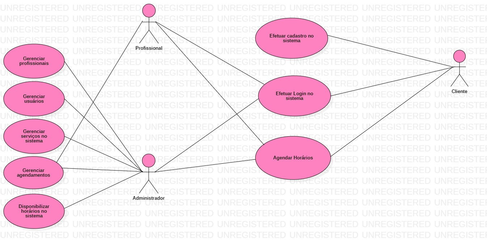
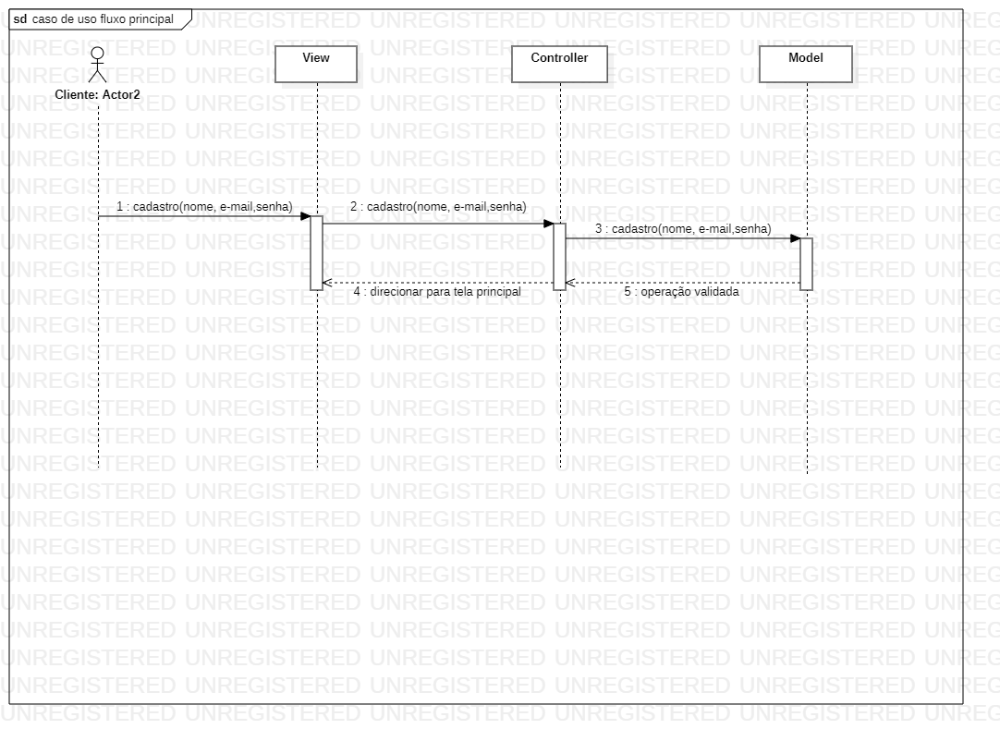
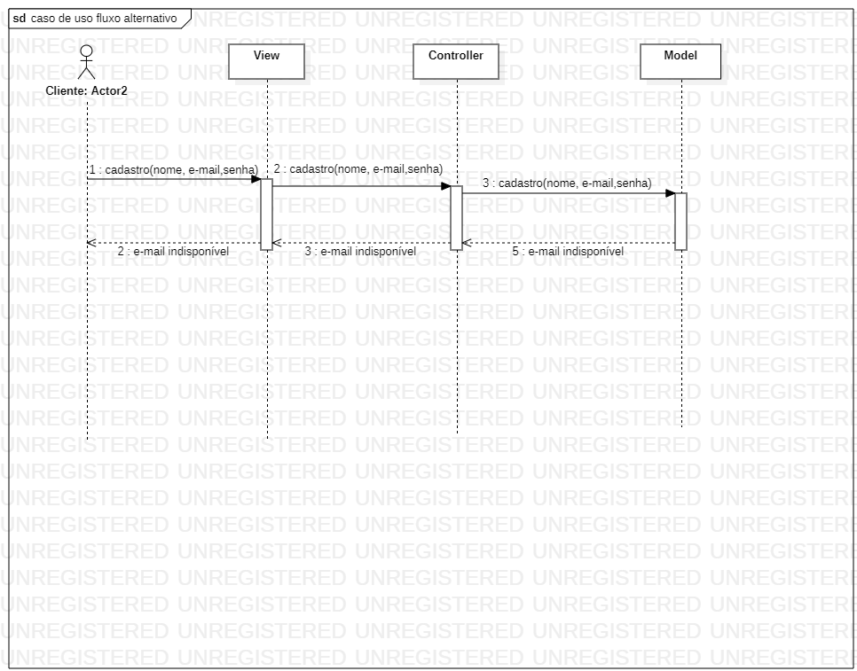
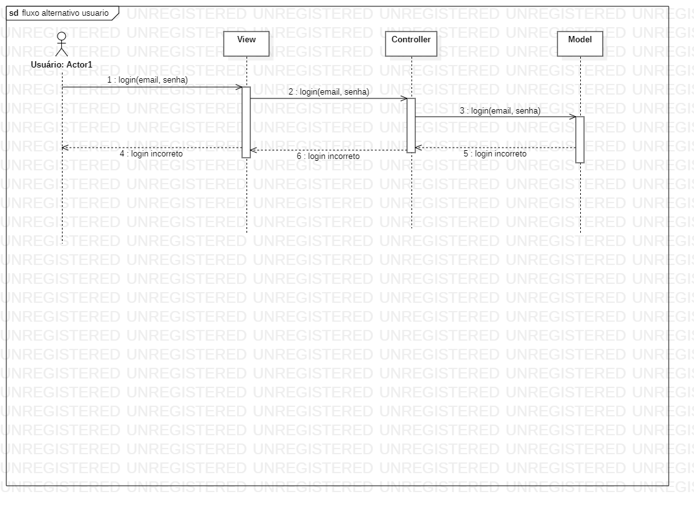
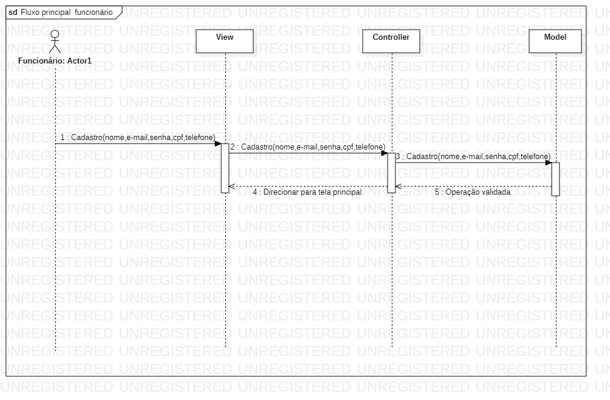
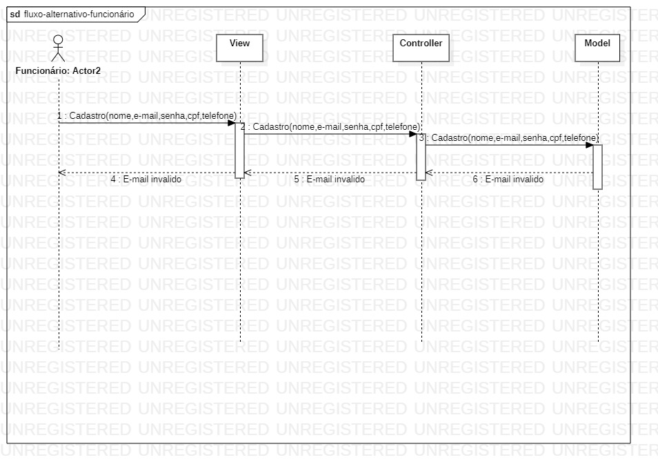
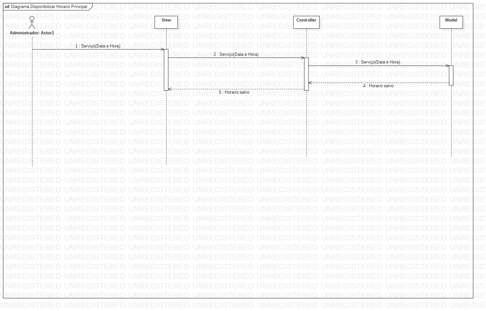
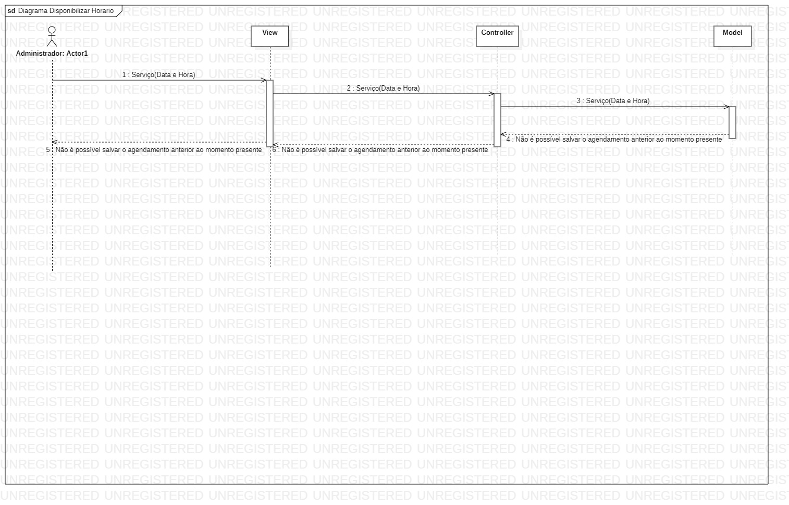
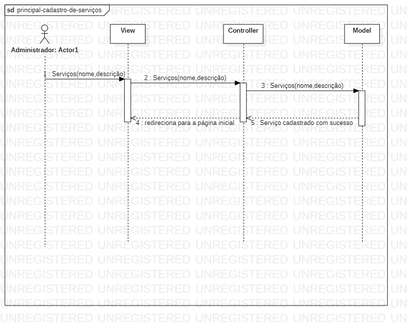
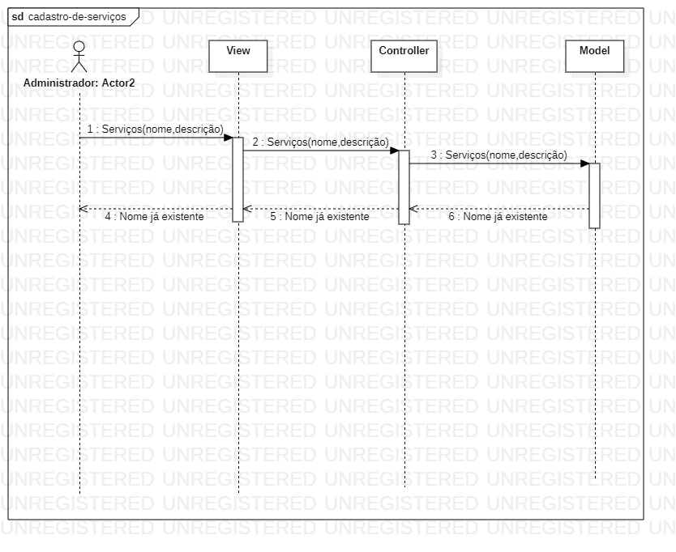

# Documento de Casos de Uso

## Lista dos Casos de Uso

 - [CDU 01](#CDU-01): Cadastro de usuário;
 - [CDU 02](#CDU-02): Efetuar login;
 - [CDU 03](#CDU-03): Adição de profissionais;
 - [CDU 04](#CDU-04): Exclusão de usuário;
 - [CDU 05](#CDU-05): Edição de usuário;
 - [CDU 06](#CDU-06): Agendamento;   
 - [CDU 07](#CDU-07): Disponibilizar horários;
 - [CDU 08](#CDU-08): Cadastro de serviços;
 

## Lista dos Atores

 - Clientes;
 - Funcionários; 
 - Administrador;

## Diagrama de Casos de Uso

## Descrição dos Casos de Uso

### CDU 01 Cadastro de usuário 

**Fluxo Principal**

1. O sistema apresentara um formulário com os campos do usuário a ser inserido
2. O usuário insere nome, e-mail e senha.
3. O usuário clica no botão “Enviar”.
4. O sistema armazena o usuário e informa que a "operação foi realizada com sucesso".
5. O sistema retorna ao início do caso de uso para inclusão de novo usuário. 

**Fluxo Alternativo A**
1. O sistema apresentara um formulário com os campos do usuário a ser inserido.
2. O usuário insere nome, e-mail e senha.
3. O usuário clica no botão “Enviar”.
4. O sistema informa que o endereço de e-mail está indisponível.
5. O usuário digita o e-mail corretamente e clica no botão “Enviar”.
6. O sistema armazena o usuário e informa que a "operação foi realizada".
7. O sistema retorna ao início do caso de uso para inclusão de novo usuário. 

**Fluxo alternativo B**
1. O sistema apresentara um formulário com os campos do usuário a ser inserido.
2. O usuário insere nome, e-mail e senha.
3. O usuário clica no botão “Inserir”.
4. O sistema informa que já existe um usuário com o e-mail fornecido e retorna ao Fluxo Principal.

**Fluxo alternativo C**
1. O sistema apresenta uma solicitação de criação de conta com as respectivas informações.
2. O usuário clica no botão “Criar esta conta”.
3. O sistema exibe um formulário com os campos do uruário a ser inserido com nome, e-mail e senha preenchido.
4. O usuário clica no botão “Inserir”.
5. O sistema armazena o cliente e informa ao usuário que a "operação foi realizada com sucesso". 

 ### CDU 02 Efetuar login  

 **Fluxo Principal**

1. O sistema exibirá um formulário com os campos login e senha.
2. O usuário deve inserir o login e a senha e clicar no botão de "ENTRA". 
3. O sistema valida login e senha do usuário.
4. O sistema encaminha o usuário para a página do cliente.
 
 

**Fluxo Alternativo A**

1. O sistema exibirá um formulário com os campos login e senha.
2. O usuário deve inserir o login e a senha e clicar no botão de "ENTRA".
3. O sistema informa que a senha está incorreta.
4. O usuário corrigir a senha e clica no botão "ENTRA".
5. O sistema encaminha o usuário para a página do cliente.

**Fluxo Alternativo B**

1. O sistma exibirá um formulário com os campos login e senha.
2. O usuário deve inserir o login e a senha e clicar no botão "ENTRA".
3. O sistema informa que o login está incorreto.
4. O usuário digita corretamente o login e clica no botão "ENTRA". 
5. O sistema encaminha o usuário para a página do cliente.

**Fluxo Alternativo c**
1. O sistema exibirá um formulário com os campos login e senha.
2. O usuário deve insere login e sua senha e clica no botão “ENTRA”.
3. O sistema informa que o login e a senha não coincidem.
4. O usuário digita corretamente as informações de login e senha e clica no botão “ENTRA”.
5. O sistema encaminha o usuário para sua página do cliente.

### CDU 03 Adição de profissionais 

**Fluxo Principal**

1. O sistema apresenta um formulario com os campos "Nome,e-mail,senha,cpf,telefone".
2. O administrador preenche o formulario.
3. O administrador clicar em "Salvar".
4. O sistema exibir a seguinte mensagem "Operação validada".
5. O sistema encaminha o administrador para tela principal.

**Fluxo Alternativo A**

1. O sistema apresenta um formulario com os campos "Nome,e-mail,senha,cpf,telefone".
2. O administrador preenche o formulario.
3. O administrador clicar em "Salvar".
4. O sistema exibir a seguinte mensagem "E-mail invalido".
5. O sistema recarrega o formulário.
6. O administrador preenche o formulario.
7. O administrador clicar em "Salvar".
8. O sistema exibir a seguinte mensagem "Operação validada".
9. O sistema encaminha o administrador para tela principal.

### CDU 04 Exclusão de usuário

**Fluxo Principal**
1. O sistema vai apresenta um formulario com a lista de usuários.
2. O administrador escolher um cliente para excluir. 
3. O administrador clica no botão "excluir".
4. O sistema vai exibir a seguinte mensagem " tem certeza que deseja excluir o usuário"
5. O administrador clica no botão "ok".  
6. O sistema exibirá que "o usuário foi excluído com sucesso". 

**Fluxo Alternativo A**
1. O sistema vai apresentar um formulario com a lista de usuários.
2. O administrador escolher um perfil para exclui. 
3. O administrador clica no botão "excluir".
4. O sistema vai exibir a seguinte mensagem " Não foi possível excluir o usuário".
5. O sistema encaminhara o administrador para a pagina inicial.

### CDU 05 Edição de usuário

**Fluxo Principal**
1. O sistema vai apresenta um formulario com a lista de usuários.
2. O administrador escolher um perfil para editar. 
3. O administrador clica no botão "editar".
4. O sistema vai exibir a sequinte mensagem " tem certeza que deseja editar o usuário"
5. O administrador clica no botão "ok".  
6. O sistema exibirá que "o usuário foi editado com sucesso". 

**Fluxo Alternativo A**
1. O sistema vai apresenta um formulario com a lista de usuários.
2. O administrador escolher um perfil para editar. 
3. O administrador clica no botão "edição".
4. O sistema vai exibir a sequinte mensagem " Não foi possível editar o usuário".
5. O sistema encaminhara o administrador para a pagina inicial.

### CDU 06 Agendamento

**Fluxo Principal**
1. O sistema vai apresenta ao cliente a interface onde ele pode escolher o serviço e o horário que deseja.
2. O cliente clica no botão "Marcar".
3. O sistema salva o agendamento.
4. O sistema exibi a sequinte mensagem " Agendamento cadastrado com sucesso"
5. O sistema redireciona o cliente para a página inicial. 

**Fluxo Alternativo A**

1. O sistema vai apresenta ao cliente a interface onde ele pode escolher o serviço e o horário que deseja. 
3. o cliente clica no botão "Marcar.
5. O sistema exibi a seguinte mensagem " Horário indisponível" 
6. O sistema recarrega o formulário. 
7. O cliente deseja remarcar o serviço.
8. O cliente vai até a interface clica no botão "Remarcar". 
9. O cliente atualiza o serviço ou o horário no formulario clica no botão "Marcar".
10. O sistema vai exibir a seguinte mensagem " Agendamento cadastrado com sucesso"
11. O sistema redireciona o cliente para a pagina inicial. 
 

### CDU 07 Disponibilizar horários

**Fluxo Principal**
1. O sistema resgata a lista de serviços e apresenta ao administrador.
2. O Administrador seleciona o serviço.
3. O Administrador seleciona a data e hora.
4. O Administrador seleciona a duração do serviço.
5. O sistema salva o horário para agendamento.

**Fluxo Alternativo A**
1. O sistema resgata a lista de serviços e apresenta ao administrador.
2. O Administrador seleciona o serviço.
3. O Administrador seleciona a data e hora anterior ao momento presente.
4. O Administrador seleciona a duração do serviço.
5. O sistema informa que não é possível salvar o agendamento anterior ao momento presente.

**Fluxo Alternativo B**
1. O sistema resgata a lista de serviços e apresenta ao administrador.
2. O Administrador seleciona o serviço.
3. O Administrador seleciona a data e hora.
4. O Administrador seleciona a duração do serviço como "0".
5. O sistema informa que não é possível salvar o horário de agendamento com a duração "0".

### CDU 08 Cadastro de serviços 

**Fluxo Principal**
1. O sistema vai apresenta um formulario onde o administrador pode cadastrar o serviço
2. O administrador preenche nome e descrição do serviço
3. O administrador clica em salvar 
4. O sistema salva o serviço exibe a seguinte mensagem "serviço cadastrado com sucesso"   
5. sistema redireciona o cliente para a página inicial. 

**Fluxo Alternativo A**

1. O sistema vai apresenta um formulario onde o administrador pode cadastrar o serviço
2. O administrador preenche nome e descrição do serviço
3. O administrador clica em salvar 
4. O sistema exibe a seguinte mensagem "Nome já existente"
5. O sistema recarrega o formulário.

