# Manual do Usuário

O Studio Nova é um espaço acolhedor de ambiente agradável, onde as clientes são atendidos por profissionais qualificados e preocupados em proporcionar momentos adoráveis. Com serviços de qualidade. Um local no qual os profissionais entendem que o trabalho em equipe e a capacitação profissional são necessários para a excelência no atendimento e satisfação das clientes. Temos como objetivo oferecer as clientes opções de serviços e uma equipe multiprofissional para que tenham um atendimento estético de qualidade. Nosso Espaço oferece as clientes serviços de Maquiagem, extensão de cílios, design de sobrancelha, limpeza facial.

Aqui nós não fazemos nada mais do que realçar essa beleza incrível que existe dentro de ti!

Valores- Comprometimento, responsabilidade e honestidade.

Sua autoestima em primeiro lugar sempre!!!!!

**Lista das Funcionalidades:**

 - [Funcionalidade X](#Funcionalidade-X)
 - [Funcionalidade Y](#Funcionalidade-Y)
 - [Funcionalidade Z](#Funcionalidade-Z)

## Cadastro

O usuário insere o nome, sobrenome, e-mail e senha desejada. O usuário clica no botão “CADASTRAR-SE”.

## Login

O usuário deve inserir o login e a senha e clicar no botão “ENTRAR”.

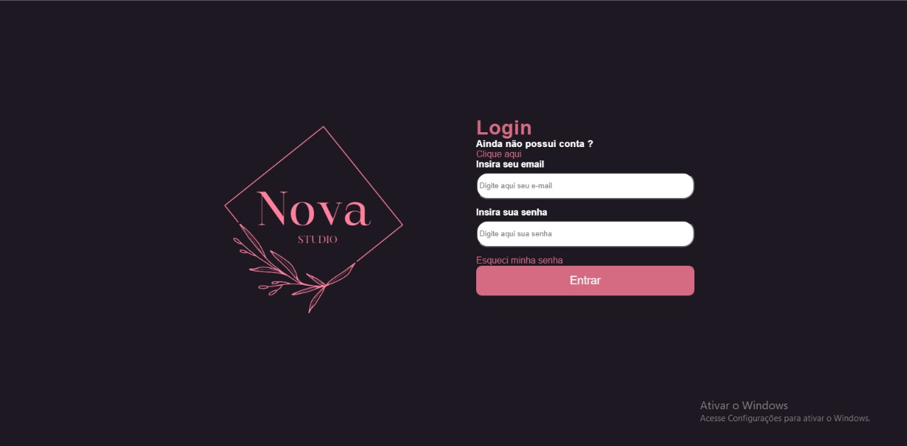

## Nossos Serviços

Ao clicar em “VER HORÁRIOS” do serviço desejado, aparecerá um modal com as datas e horários disponíveis para o cliente.

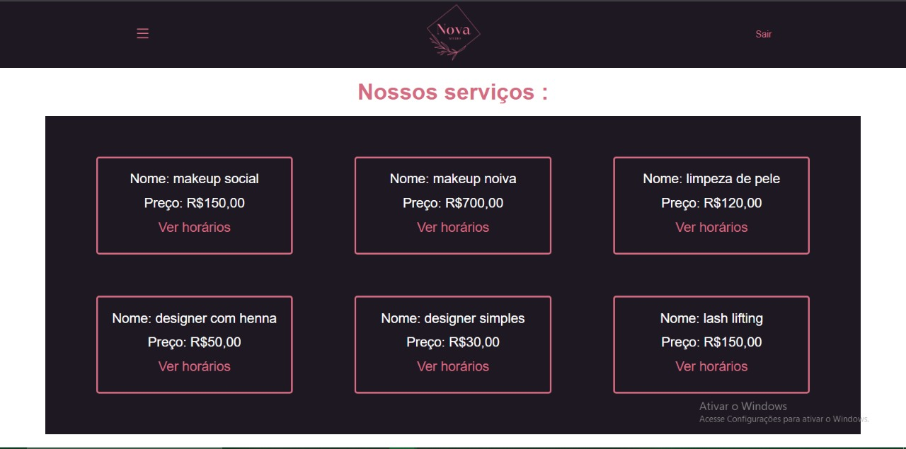

## Agendar Serviços

Ao clicar em “AGENDAR SERVIÇOS” aparecerá um modal para confirmar ou cancelar o agendamento.

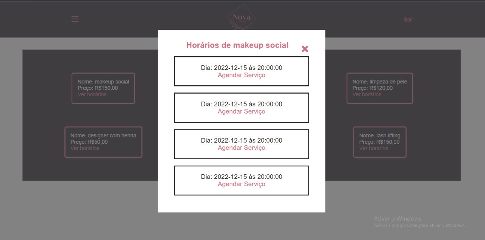

## Confirmação de Agendamento

Após confirmar o agendamento aparecerá uma mensagem “agendamento efetuado com sucesso”.

## Menu

Ao clicar no menu lateral aparecerá os botões “início, meu perfil, meus agendamentos e sair”.

Ao clicar em “INÍCIO” o cliente será direcionado a página inicial.

Ao clicar em “SAIR” aparecerá um modal onde o cliente pode confirmar ou cancelar o
encerramento da sessão.

## Meu Perfil

Ao clicar em “MEU PERFIL” o cliente será direcionado a página “editar seus dados”.

EDITAR DADOS:

O cliente insere nome, sobrenome e e-mail. O cliente clica em “EDITAR”.
O cliente informa sua nova senha e clica em “EDITAR DADOS”

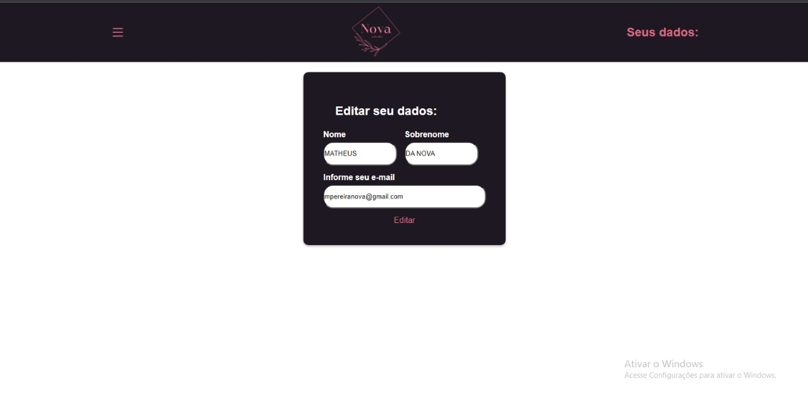

## Meus Agendamentos

Ao clicar em “MEUS AGENDAMENTOS” o cliente será direcionado a página “seus agendamentos”.

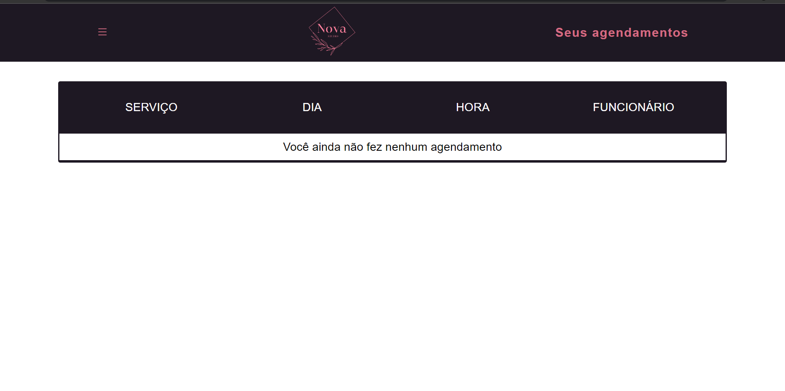

## Login do Administrador

O Administrador deve inserir o login e a senha e clicar no botão “ENTRAR”.

## Funcionalidade Z

......................
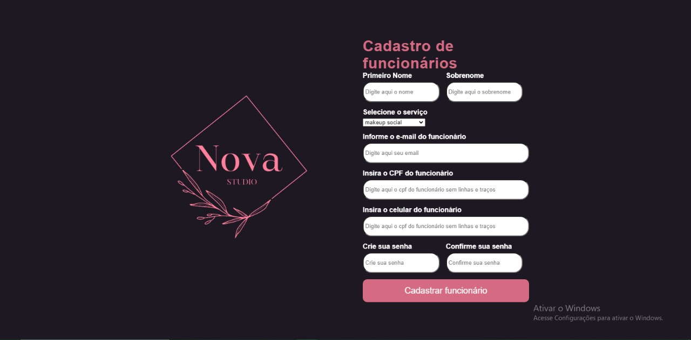

## Funcionalidade Z

......................
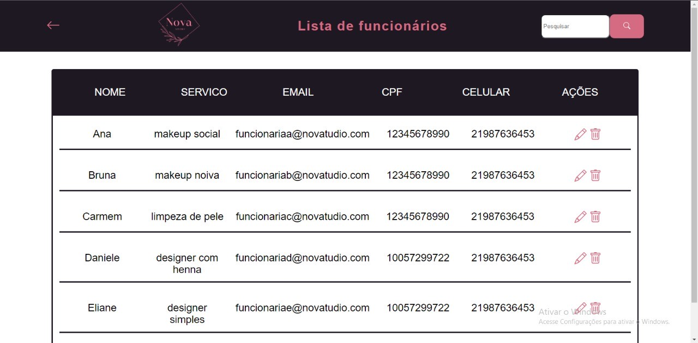

## Funcionalidade Z

......................
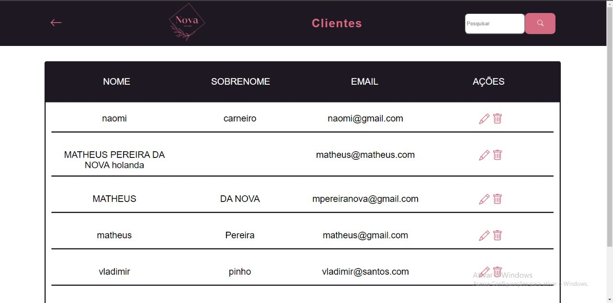

## Funcionalidade Z

......................
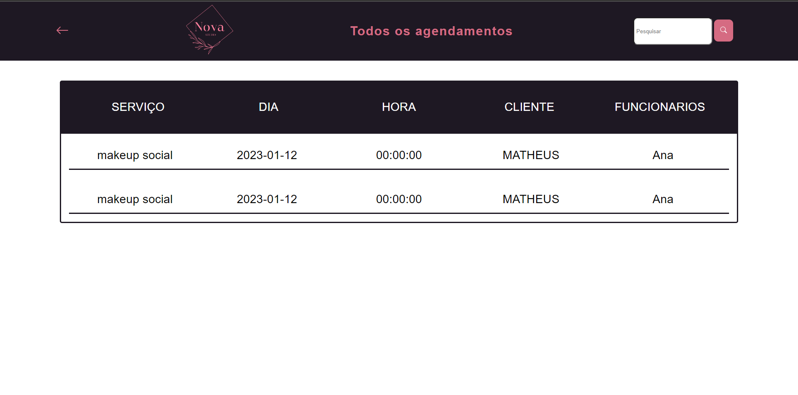

## Funcionalidade Z

......................
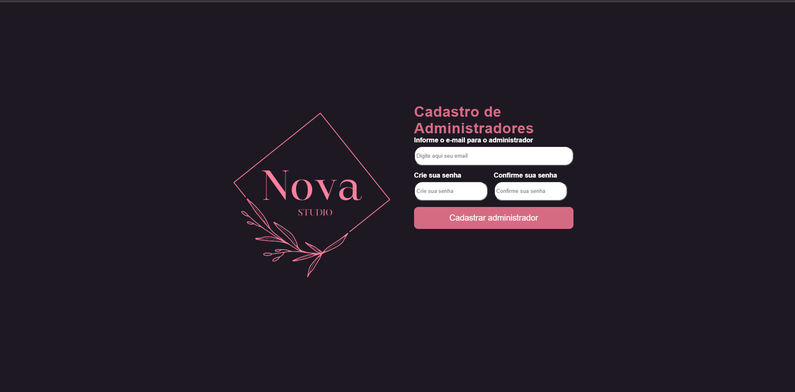

## Funcionalidade Z

......................

## Funcionalidade Z

......................
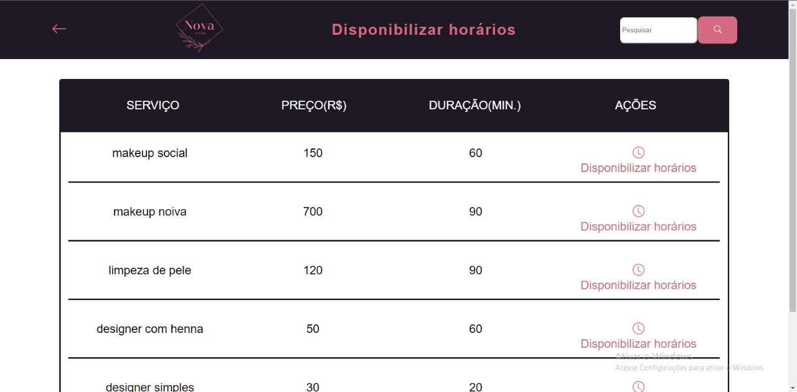

## Funcionalidade Z

......................

## Funcionalidade Z

......................
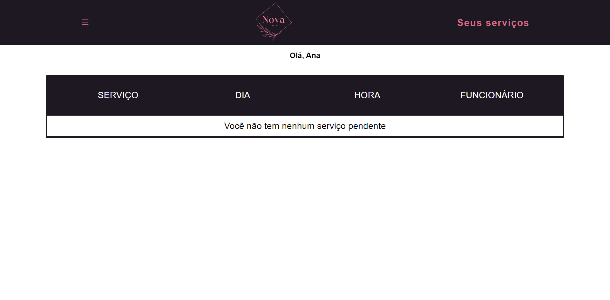

## Funcionalidade Z

......................
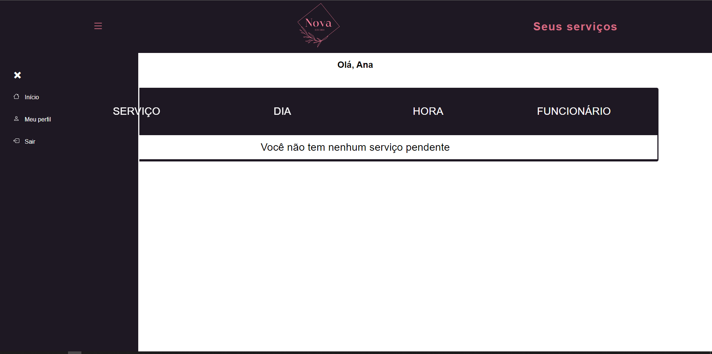

## Funcionalidade Z

......................
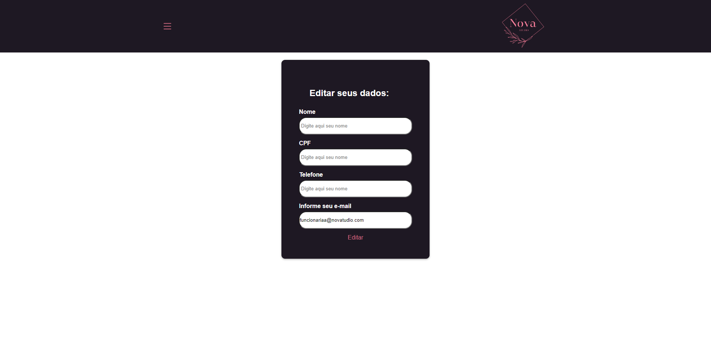

