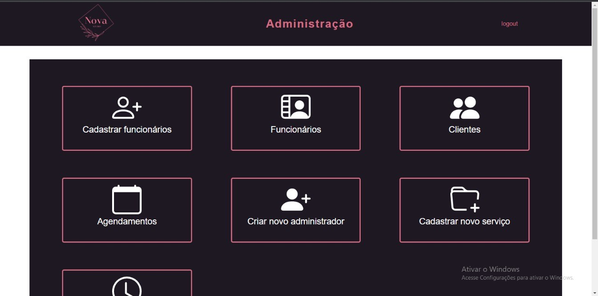
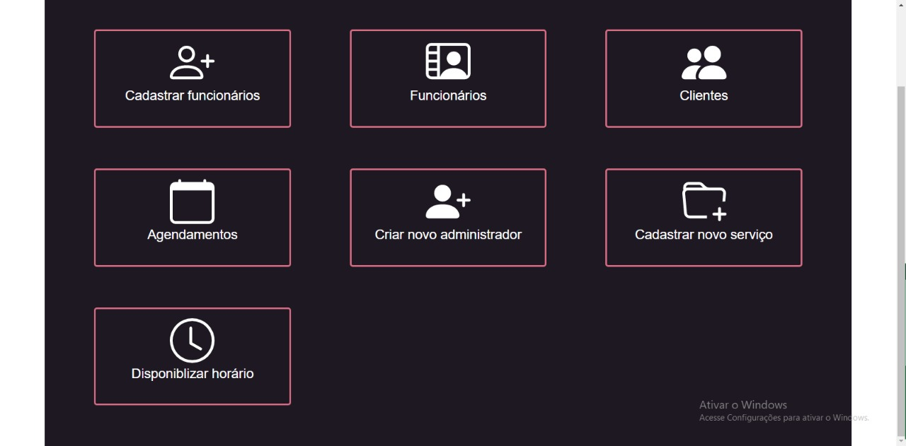

# Manual do Usuário

O Studio Nova é um espaço acolhedor de ambiente agradável, onde as clientes são atendidos por profissionais qualificados e preocupados em proporcionar momentos adoráveis. Com serviços de qualidade. Um local no qual os profissionais entendem que o trabalho em equipe e a capacitação profissional são necessários para a excelência no atendimento e satisfação das clientes. Temos como objetivo oferecer as clientes opções de serviços e uma equipe multiprofissional para que tenham um atendimento estético de qualidade. Nosso Espaço oferece as clientes serviços de Maquiagem, extensão de cílios, design de sobrancelha, limpeza facial.

Aqui nós não fazemos nada mais do que realçar essa beleza incrível que existe dentro de ti!

Valores- Comprometimento, responsabilidade e honestidade.

Sua autoestima em primeiro lugar sempre!!!!!

**Lista das Funcionalidades:**

 - [Cadastro](Cadastro)
 - [Login](Login)
 - [Nossos serviços](studio)
 - [Agendar serviços](studio)
 - [Confirmação de Agendamento](studio)
 - [Menu](Menu)
 - [Meu Perfil](studio)
 - [Meus Agendamentos](studio)
 - [Login do Administrador](studio)
 - [Administração](studio)
 - [Cadastro de Funcionários](studio)
 - [Lista de Funcionários](studio)
 - [Lista de Clientes](studio)
 - [Agendamentos](studio)
 - [Cadastro de administradores](studio)
 - [Cadastro dos Serviços](studio)
 - [Disponobilizar Horários](studio)
 - [Login Funcionário](studio)
 - [Serviços do Funcionário](studio)
 - [Menu do funcionário](studio)
 - [Perfil do Funcionário](studio)

## Cadastro

O usuário insere o nome, sobrenome, e-mail e senha desejada. O usuário clica no botão “CADASTRAR-SE”.

## Login

O usuário deve inserir o login e a senha e clicar no botão “ENTRAR”.

## Nossos Serviços

Ao clicar em “VER HORÁRIOS” do serviço desejado, aparecerá um modal com as datas e horários disponíveis para o cliente.

## Agendar Serviços

Ao clicar em “AGENDAR SERVIÇOS” aparecerá um modal para confirmar ou cancelar o agendamento.

## Confirmação de Agendamento

Após confirmar o agendamento aparecerá uma mensagem “agendamento efetuado com sucesso”.

## Menu

Ao clicar no menu lateral aparecerá os botões “início, meu perfil, meus agendamentos e sair”.

Ao clicar em “INÍCIO” o cliente será direcionado a página inicial.

Ao clicar em “SAIR” aparecerá um modal onde o cliente pode confirmar ou cancelar o
encerramento da sessão.

## Meu Perfil

Ao clicar em “MEU PERFIL” o cliente será direcionado a página “editar seus dados”.

EDITAR DADOS:

O cliente insere nome, sobrenome e e-mail. O cliente clica em “EDITAR”.
O cliente informa sua nova senha e clica em “EDITAR DADOS”

## Meus Agendamentos

Ao clicar em “MEUS AGENDAMENTOS” o cliente será direcionado a página “seus agendamentos”.

## Login do Administrador

O Administrador deve inserir o login e a senha e clicar no botão “ENTRAR”.

## Administração

Ao clicar em “CADASTRAR FUNCIONÁRIOS”, o administrador será direcionado a página de “cadastro de funcionários”.

Ao clicar em “FUNCIONÁRIOS”, o administrador será direcionado a página de “lista de funcionários”.

Ao clicar em “CLIENTES”, o administrador será direcionado a página de “lista de clientes”.

Ao clicar em “AGENDAMENTOS”, o administrador será direcionado a página de “todos os agendamentos”.

Ao clicar em “CRIAR NOVO ADMINISTRADOR”, o administrador será direcionado a página “cadastro de administradores”.

Ao clicar em “CADASTRAR NOVO SERVIÇO”, o administrador será direcionado a página “cadastro de serviços”.

Ao clicar em “DISPONIBILIZAR HORÁRIO”, o administrador será direcionado a página “disponibilizar horários”.

## Cadastro de Funcionarios 

O Administrador insere o nome, sobrenome do Funcionário, clica em selecionar serviços para escolher o serviço desejado, insere o e-mail, CPF, 
número de celular e senha desejada. 
O Administrador clica em “CADASTRAR FUNCIONÁRIO”

## Lista de Funcionario

Ao clicar na “SETA” e na “LOGO”, o administrador conseguirá voltar para página de administração.

Ao clicar na “LIXEIRA”, o administrador conseguirá excluir o funcionário correspondente daquela linha. Após ele clicar na
“lixeira” aparecerá um modal para confirmar exclusão ou cancelar.

Ao clicar no “LÁPIS”, o administrador conseguirá editar o funcionário correspondente daquela linha. Após clicar no 
“lápis” aparecerá um modal para confirmar edição ou cancelar edição.

## Lista de Clientes

Ao clicar na “LUPA”, o administrador conseguirá pesquisar qualquer dado exibido na tela.

Ao clicar na “SETA” e na “LOGO”, o administrador conseguirá voltar para página de administração.

Ao clicar na “LIXEIRA”, o administrador conseguirá excluir o cliente correspondente daquela linha. Após ele clicar
na “lixeira” aparecerá um modal para confirmar exclusão ou cancelar.

Ao clicar no “LÁPIS”, o administrador conseguirá editar o cliente correspondente daquela linha. Após clicar no 
“lápis” aparecerá um modal para confirmar edição ou cancelar edição.

## Agendamentos 

 Uma tabela que contem a lista dos agendamendo do studionova, nessa lista contem os serviços, dia,
 hora, o cliente que marcou o serviço e o profissional que vai executar o serviço.
 

## Cadastro de administradores 

O administrador insere e-mail e senha desejada. O administrador clica em “CADASTRAR ADMINISTRADOR”.

## Cadastro dos serviços 

O administrador informa o nome do serviço, o preço do serviço e a duração do serviço.

## Disponibilizar horários

Ao clicar na “LUPA”, o administrador conseguirá pesquisar qualquer dado exibido na tela.

Ao clicar na “SETA” e na “LOGO”, o administrador conseguirá voltar para página de administração.

Ao clicar em “DISPONIBILIZAR HORÁRIOS” aparecerá um modal para inserir “dia, mês, ano e horário”. 
Após inserir os dados, aparecerá o modal “horário salvo com sucesso” ou “horário indisponível” se caso não for possível agendar naquele horário/data.

## Login Funcionário
O Funcionário deve inserir o login e a senha e clicar no botão “ENTRAR”.

## Serviços do Funcionário
O funcionário observa os seus serviços agendados.

## Menu do Funcionário
Ao clicar no menu lateral aparecerá os botões “início, meu perfil e sair”.

Ao clicar em “INÍCIO” o Funcinário será direcionado a página inicial.

Ao clicar em “SAIR” aparecerá um modal onde o Funcionário pode confirmar ou cancelar o encerramento da sessão.

## Perfil do Funcionário
O funcionário insere nome, CPF, telefone, e e-mail. O funcionário clica em “EDITAR” 
Os dados serão editados.

